# Step 1: Setting Up Your Vibe Coding Environment

## Overview

This guide walks you through setting up VSCode with the Claude AI assistant on Windows (via WSL) or native Ubuntu. By the end, you'll have a modern development environment ready for network automation.

```mermaid
flowchart LR
    A[Windows/Ubuntu] --> B[VSCode]
    B --> C[Claude Extension]
    C --> D[🚀 Ready to Code]
```



---

## Prerequisites

| Requirement | Windows | Ubuntu |
|-------------|---------|--------|
| OS Version | Windows 10/11 | 20.04+ |
| RAM | 8GB minimum | 8GB minimum |
| Disk Space | 5GB free | 5GB free |
| Internet | Required | Required |

---

## Choose Your Path


---

## Windows Users: Install WSL2

WSL (Windows Subsystem for Linux) lets you run a full Linux environment directly on Windows - no dual-boot or VM needed.

### 1. Enable WSL

Open **PowerShell as Administrator** and run:

```powershell
wsl --install
```

This installs WSL2 with Ubuntu by default. **Restart your computer** when prompted.

### 2. Complete Ubuntu Setup

After restart, Ubuntu will launch automatically. Create your Linux username and password when prompted.

> **Note:** This username/password is separate from your Windows credentials. Choose something memorable.

### 3. Update Your Linux Environment

In the Ubuntu terminal:

```bash
sudo apt update && sudo apt upgrade -y
```

---

## Install VSCode

### Windows

1. Download VSCode from [code.visualstudio.com](https://code.visualstudio.com)
2. Run the installer with default options
3. **Important:** Check "Add to PATH" during installation

### Ubuntu (Native)

```bash
sudo apt install software-properties-common apt-transport-https wget -y
wget -q https://packages.microsoft.com/keys/microsoft.asc -O- | sudo apt-key add -
sudo add-apt-repository "deb [arch=amd64] https://packages.microsoft.com/repos/vscode stable main"
sudo apt update
sudo apt install code -y
```

---

## Connect VSCode to WSL (Windows Users Only)


### 1. Install the WSL Extension

1. Open VSCode
2. Press `Ctrl+Shift+X` to open Extensions
3. Search for **"WSL"** (by Microsoft)
4. Click **Install**

### 2. Connect to WSL

1. Press `Ctrl+Shift+P` to open Command Palette
2. Type `WSL: Connect to WSL`
3. Select it - VSCode will reload connected to your Ubuntu environment

> **Tip:** Look at the bottom-left corner of VSCode. You should see `WSL: Ubuntu` indicating you're connected.

---

## Install the Claude Extension

The Claude extension brings AI-assisted coding directly into VSCode.

### 1. Open Extensions

- Press `Ctrl+Shift+X`
- Search for **"Claude"** (by Anthropic)
- Click **Install**

### 2. Authenticate with Anthropic

1. After installation, you'll see a Claude icon in the left sidebar
2. Click it to open the Claude panel
3. Click **Sign In**
4. Follow the browser prompts to authenticate with your Anthropic account

> **Note:** You'll need an Anthropic account with API access. Sign up at [anthropic.com](https://anthropic.com) if you haven't already.


---

## Verify Your Setup

Run through this checklist to confirm everything is working:

| Check | How to Verify |
|-------|---------------|
| WSL Connected (Windows) | Bottom-left shows `WSL: Ubuntu` |
| Claude Extension | Claude icon visible in sidebar |
| Claude Authenticated | Claude panel shows your account, no login prompt |
| Terminal Works | `Ctrl+`` opens terminal in Linux environment |

### Quick Test

1. Open the integrated terminal (`Ctrl+``)
2. Run: `python3 --version`
3. If Python isn't installed, we'll cover that in the next step

---

## Troubleshooting

### WSL Won't Install
- Ensure virtualization is enabled in BIOS
- Run `wsl --status` to check for errors
- Try: `wsl --update`

### VSCode Can't Connect to WSL
- Restart VSCode
- In terminal run: `code .` from within WSL to force connection
- Reinstall the WSL extension

### Claude Extension Not Working
- Check internet connection
- Sign out and sign back in
- Check [status.anthropic.com](https://status.anthropic.com) for service issues

---

## What's Next?

With your environment ready, Step 2 will cover installing the tools network engineers need:
- Python and package managers
- Network automation libraries (Netmiko, NAPALM, Nornir)
- Git for version control

---

## Quick Reference


**Keyboard Shortcuts to Remember:**
| Action | Shortcut |
|--------|----------|
| Open Extensions | `Ctrl+Shift+X` |
| Command Palette | `Ctrl+Shift+P` |
| Toggle Terminal | `Ctrl+`` |
| Open Claude Panel | Click sidebar icon |
