# VoIP and Cloud Calling: A Comprehensive Technical Overview

## Table of Contents
1. [Foundational Concepts](#foundational-concepts)
2. [PSTN Architecture](#pstn-architecture)
3. [SIP Trunking Deep Dive](#sip-trunking-deep-dive)
4. [Microsoft Teams Calling](#microsoft-teams-calling)
5. [Cisco Webex Calling](#cisco-webex-calling)
6. [Enterprise Network Integration](#enterprise-network-integration)
7. [Quality of Service (QoS)](#quality-of-service-qos)
8. [Security Considerations](#security-considerations)

---

## Foundational Concepts

### What is VoIP?

Voice over Internet Protocol (VoIP) is the technology that enables voice communications over IP networks instead of traditional circuit-switched telephone networks. VoIP converts analog voice signals into digital packets that traverse IP networks.

### Key Protocols

| Protocol | Purpose | Port(s) |
|----------|---------|---------|
| **SIP** (Session Initiation Protocol) | Call signaling, session setup/teardown | 5060 (UDP/TCP), 5061 (TLS) |
| **RTP** (Real-time Transport Protocol) | Media (audio/video) transport | Dynamic (typically 16384-32767) |
| **SRTP** (Secure RTP) | Encrypted media transport | Same as RTP |
| **H.323** | Legacy signaling protocol | 1720 (TCP) |
| **MGCP** | Media Gateway Control Protocol | 2427 (UDP) |

### Circuit-Switched vs Packet-Switched

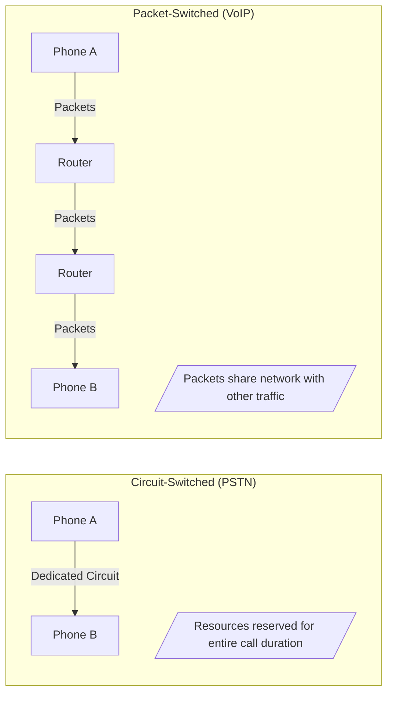
```mermaid
flowchart LR
    subgraph Circuit["Circuit-Switched (PSTN)"]
        A1[Phone A] -->|Dedicated Circuit| B1[Phone B]
        note1[/"Resources reserved for entire call duration"/]
    end
    
    subgraph Packet["Packet-Switched (VoIP)"]
        A2[Phone A] -->|Packets| R1[Router]
        R1 -->|Packets| R2[Router]
        R2 -->|Packets| B2[Phone B]
        note2[/"Packets share network with other traffic"/]
    end
```

---

## PSTN Architecture

### Overview

The **Public Switched Telephone Network (PSTN)** is the aggregate of the world's circuit-switched telephone networks. Despite the rise of VoIP, PSTN remains critical infrastructure that cloud calling systems must interface with.

### PSTN Components

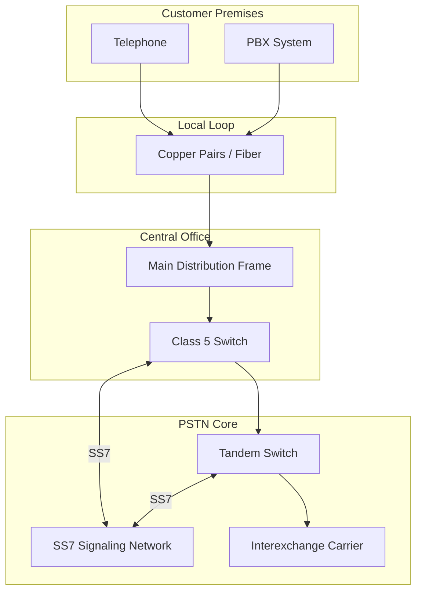
```mermaid
flowchart TB
    subgraph Customer["Customer Premises"]
        Phone[Telephone]
        PBX[PBX System]
    end
    
    subgraph LocalLoop["Local Loop"]
        Copper[Copper Pairs / Fiber]
    end
    
    subgraph CO["Central Office"]
        Switch[Class 5 Switch]
        MDF[Main Distribution Frame]
    end
    
    subgraph Core["PSTN Core"]
        Tandem[Tandem Switch]
        SS7[SS7 Signaling Network]
        IXC[Interexchange Carrier]
    end
    
    Phone --> Copper
    PBX --> Copper
    Copper --> MDF
    MDF --> Switch
    Switch <-->|SS7| SS7
    Switch --> Tandem
    Tandem <-->|SS7| SS7
    Tandem --> IXC
```

### Signaling System 7 (SS7)

SS7 is the signaling protocol suite used by PSTN for:
- Call setup, management, and teardown
- Number translation and local number portability
- Toll-free and premium rate services
- SMS delivery (in mobile networks)
- Caller ID delivery

### PSTN Interconnection Types

| Type | Channels | Bandwidth | Use Case |
|------|----------|-----------|----------|
| **Analog (POTS)** | 1 | 64 Kbps | Single lines, fax |
| **BRI (ISDN)** | 2B + D | 144 Kbps | Small office |
| **PRI (T1)** | 23B + D | 1.544 Mbps | Enterprise |
| **PRI (E1)** | 30B + D | 2.048 Mbps | Enterprise (Europe) |

---

## SIP Trunking Deep Dive

### What is a SIP Trunk?

A SIP trunk is a virtual connection between an enterprise and an **Internet Telephony Service Provider (ITSP)** that enables voice calls over an IP network to reach the PSTN.

### SIP Trunk Architecture

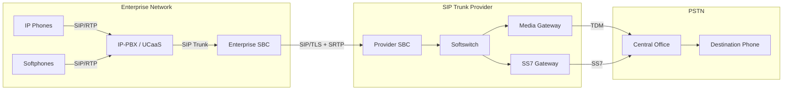
```mermaid
flowchart LR
    subgraph Enterprise["Enterprise Network"]
        IPPhone[IP Phones]
        Soft[Softphones]
        PBX[IP-PBX / UCaaS]
        SBC_E[Enterprise SBC]
    end
    
    subgraph ITSP["SIP Trunk Provider"]
        SBC_P[Provider SBC]
        SSwitch[Softswitch]
        MGW[Media Gateway]
        SS7GW[SS7 Gateway]
    end
    
    subgraph PSTN_Cloud["PSTN"]
        CO[Central Office]
        Dest[Destination Phone]
    end
    
    IPPhone -->|SIP/RTP| PBX
    Soft -->|SIP/RTP| PBX
    PBX -->|SIP Trunk| SBC_E
    SBC_E -->|"SIP/TLS + SRTP"| SBC_P
    SBC_P --> SSwitch
    SSwitch --> MGW
    SSwitch --> SS7GW
    MGW -->|TDM| CO
    SS7GW -->|SS7| CO
    CO --> Dest
```

### Session Border Controller (SBC) Functions

The SBC is a critical component in VoIP deployments:

**Security Functions:**
- Topology hiding (masks internal network structure)
- DoS/DDoS protection
- Encryption/decryption (TLS/SRTP)
- Access control and authentication
- Fraud detection

**Interoperability Functions:**
- Protocol normalization (SIP header manipulation)
- Codec transcoding
- NAT traversal
- Media anchoring

**Policy Functions:**
- Call admission control
- Bandwidth management
- Routing decisions
- Quality monitoring

### SIP Call Flow (Outbound to PSTN)

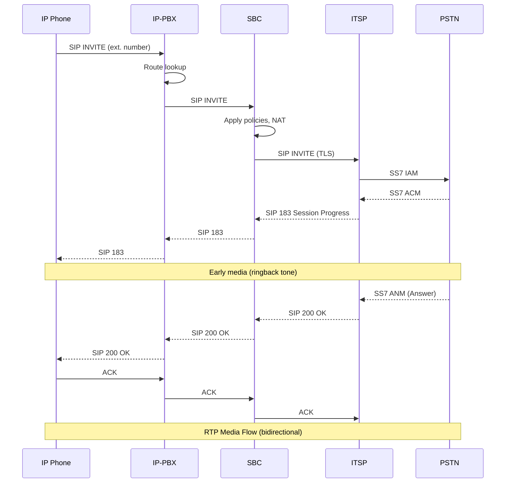
```mermaid
sequenceDiagram
    participant Phone as IP Phone
    participant PBX as IP-PBX
    participant SBC as SBC
    participant ITSP as ITSP
    participant PSTN as PSTN
    
    Phone->>PBX: SIP INVITE (ext. number)
    PBX->>PBX: Route lookup
    PBX->>SBC: SIP INVITE
    SBC->>SBC: Apply policies, NAT
    SBC->>ITSP: SIP INVITE (TLS)
    ITSP->>PSTN: SS7 IAM
    PSTN-->>ITSP: SS7 ACM
    ITSP-->>SBC: SIP 183 Session Progress
    SBC-->>PBX: SIP 183
    PBX-->>Phone: SIP 183
    Note over Phone,PSTN: Early media (ringback tone)
    PSTN-->>ITSP: SS7 ANM (Answer)
    ITSP-->>SBC: SIP 200 OK
    SBC-->>PBX: SIP 200 OK
    PBX-->>Phone: SIP 200 OK
    Phone->>PBX: ACK
    PBX->>SBC: ACK
    SBC->>ITSP: ACK
    Note over Phone,PSTN: RTP Media Flow (bidirectional)
```

---

## Microsoft Teams Calling

Microsoft Teams offers several architectures for PSTN connectivity, each with different trade-offs.

### Teams Calling Options Overview

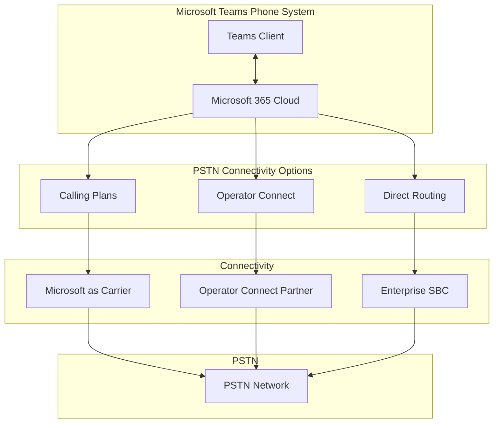
```mermaid
flowchart TB
    subgraph Teams["Microsoft Teams Phone System"]
        TeamsClient[Teams Client]
        M365[Microsoft 365 Cloud]
    end
    
    subgraph Options["PSTN Connectivity Options"]
        CP[Calling Plans]
        OC[Operator Connect]
        DR[Direct Routing]
    end
    
    subgraph Providers["Connectivity"]
        MSCarrier[Microsoft as Carrier]
        OCPartner[Operator Connect Partner]
        EntSBC[Enterprise SBC]
    end
    
    subgraph Destination["PSTN"]
        PSTN_Net[PSTN Network]
    end
    
    TeamsClient <--> M365
    M365 --> CP
    M365 --> OC
    M365 --> DR
    
    CP --> MSCarrier
    OC --> OCPartner
    DR --> EntSBC
    
    MSCarrier --> PSTN_Net
    OCPartner --> PSTN_Net
    EntSBC --> PSTN_Net
```

### Option 1: Microsoft Calling Plans

The simplest option where Microsoft acts as the PSTN carrier.

**Pros:**
- No on-premises equipment required
- Simple licensing and management
- Quick deployment

**Cons:**
- Limited geographic availability
- Less control over call routing
- Can be expensive at scale
- Limited to Microsoft's carrier relationships

**Architecture:**

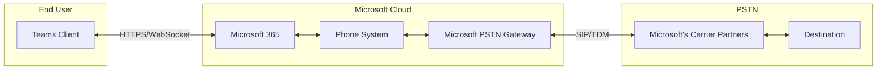
```mermaid
flowchart LR
    subgraph User["End User"]
        TC[Teams Client]
    end
    
    subgraph Microsoft["Microsoft Cloud"]
        M365[Microsoft 365]
        PS[Phone System]
        GW[Microsoft PSTN Gateway]
    end
    
    subgraph PSTN_Region["PSTN"]
        Carrier[Microsoft's Carrier Partners]
        Dest[Destination]
    end
    
    TC <-->|"HTTPS/WebSocket"| M365
    M365 <--> PS
    PS <--> GW
    GW <-->|SIP/TDM| Carrier
    Carrier <--> Dest
```

### Option 2: Operator Connect

A hybrid approach where certified operators provide PSTN connectivity directly to Microsoft Teams.

**Pros:**
- Carrier-managed infrastructure
- Simplified management via Teams Admin Center
- Leverage existing carrier relationships
- Better geographic coverage than Calling Plans

**Cons:**
- Requires certified Operator Connect partner
- Less control than Direct Routing
- Partner availability varies by region

### Option 3: Direct Routing

The most flexible option, connecting your own SBC to Microsoft Teams.

**Pros:**
- Use any PSTN carrier
- Full control over call routing
- Leverage existing SIP trunks
- Support for survivability scenarios
- Cost optimization opportunities

**Cons:**
- Requires on-premises or cloud SBC
- More complex to deploy and manage
- Requires expertise in SIP and SBC configuration

**Direct Routing Architecture:**

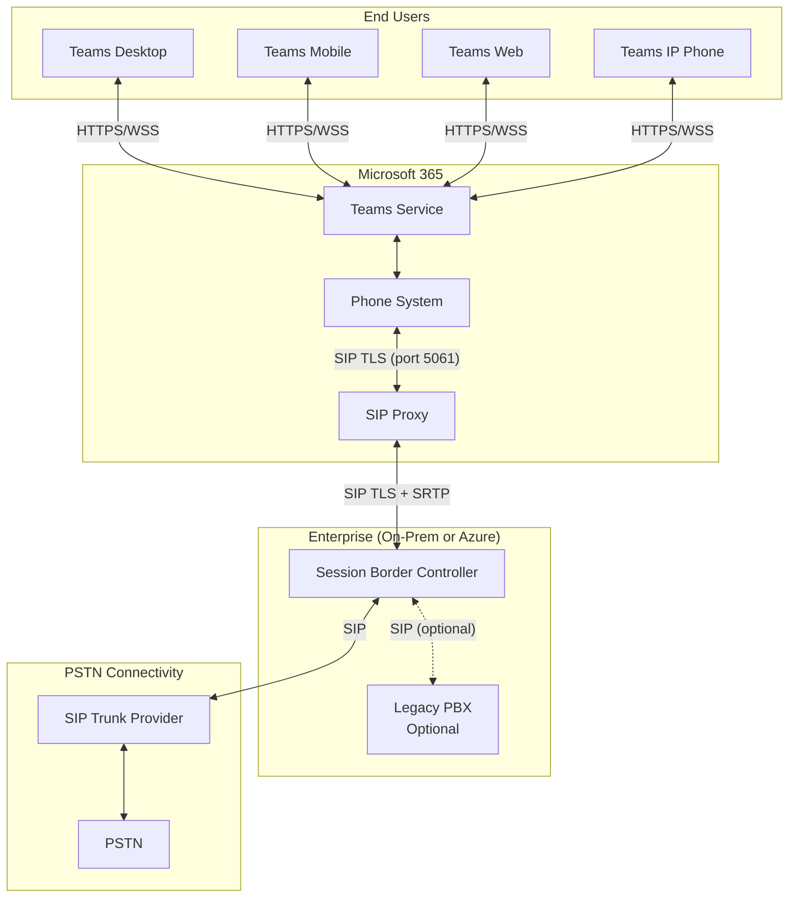
```mermaid
flowchart TB
    subgraph Users["End Users"]
        TC1[Teams Desktop]
        TC2[Teams Mobile]
        TC3[Teams Web]
        IPP[Teams IP Phone]
    end
    
    subgraph Microsoft["Microsoft 365"]
        Teams[Teams Service]
        PS[Phone System]
        SIPProxy[SIP Proxy]
    end
    
    subgraph Enterprise["Enterprise (On-Prem or Azure)"]
        SBC[Session Border Controller]
        PBX[Legacy PBX<br/>Optional]
    end
    
    subgraph Carrier["PSTN Connectivity"]
        Trunk[SIP Trunk Provider]
        PSTN[PSTN]
    end
    
    TC1 & TC2 & TC3 & IPP <-->|HTTPS/WSS| Teams
    Teams <--> PS
    PS <-->|"SIP TLS (port 5061)"| SIPProxy
    SIPProxy <-->|"SIP TLS + SRTP"| SBC
    SBC <-->|SIP| Trunk
    SBC <-.->|"SIP (optional)"| PBX
    Trunk <--> PSTN
```

### Direct Routing Requirements

**Network Requirements:**
- SBC must have public IP address (or proper NAT configuration)
- Ports: 5061 (SIP/TLS), 49152-53247 (SRTP media)
- DNS SRV records for Microsoft SIP proxies
- TLS 1.2 with valid public certificate

**SBC Requirements:**
- Microsoft-certified SBC (AudioCodes, Ribbon, Oracle, Cisco, etc.)
- Support for SIP over TLS
- SRTP support
- Media bypass capability (recommended)

**Firewall Rules (Outbound):**

| Destination | Ports | Protocol | Purpose |
|-------------|-------|----------|---------|
| sip.pstnhub.microsoft.com | 5061 | TCP/TLS | Primary SIP signaling |
| sip2.pstnhub.microsoft.com | 5061 | TCP/TLS | Secondary SIP signaling |
| sip3.pstnhub.microsoft.com | 5061 | TCP/TLS | Tertiary SIP signaling |
| *.pstnhub.microsoft.com | 5061 | TCP/TLS | Failover |
| 52.112.0.0/14 | 49152-53247 | UDP | Media (SRTP) |

### Media Bypass

Media bypass allows RTP media to flow directly between the Teams client and the SBC, reducing latency and improving quality.

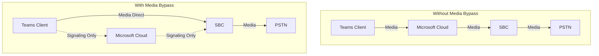
```mermaid
flowchart TB
    subgraph Without["Without Media Bypass"]
        direction LR
        C1[Teams Client] -->|Media| MS1[Microsoft Cloud]
        MS1 -->|Media| SBC1[SBC]
        SBC1 -->|Media| PSTN1[PSTN]
    end
    
    subgraph With["With Media Bypass"]
        direction LR
        C2[Teams Client] -->|Media Direct| SBC2[SBC]
        SBC2 -->|Media| PSTN2[PSTN]
        C2 -.->|Signaling Only| MS2[Microsoft Cloud]
        MS2 -.->|Signaling Only| SBC2
    end
```

### Local Media Optimization (LMO)

For branch office scenarios, LMO keeps media local when users and SBC are in the same location.

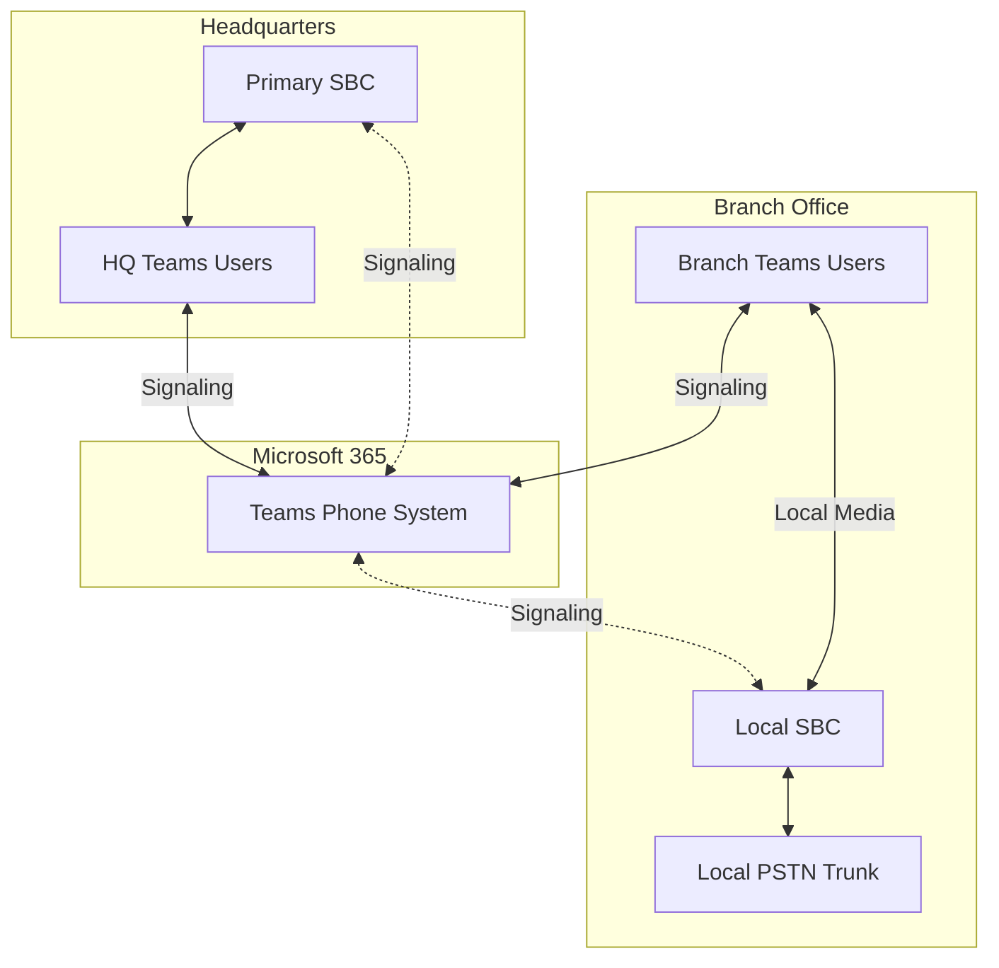
```mermaid
flowchart TB
    subgraph HQ["Headquarters"]
        HQ_SBC[Primary SBC]
        HQ_Users[HQ Teams Users]
    end
    
    subgraph Branch["Branch Office"]
        BR_SBC[Local SBC]
        BR_Users[Branch Teams Users]
        BR_PSTN[Local PSTN Trunk]
    end
    
    subgraph MS["Microsoft 365"]
        Teams[Teams Phone System]
    end
    
    HQ_Users <-->|Signaling| Teams
    BR_Users <-->|Signaling| Teams
    Teams <-.->|Signaling| HQ_SBC
    Teams <-.->|Signaling| BR_SBC
    
    BR_Users <-->|"Local Media"| BR_SBC
    BR_SBC <--> BR_PSTN
    
    HQ_SBC <--> HQ_Users
```

---

## Cisco Webex Calling

Webex Calling is Cisco's cloud-based calling solution with multiple deployment models for PSTN connectivity.

### Webex Calling Architecture Overview

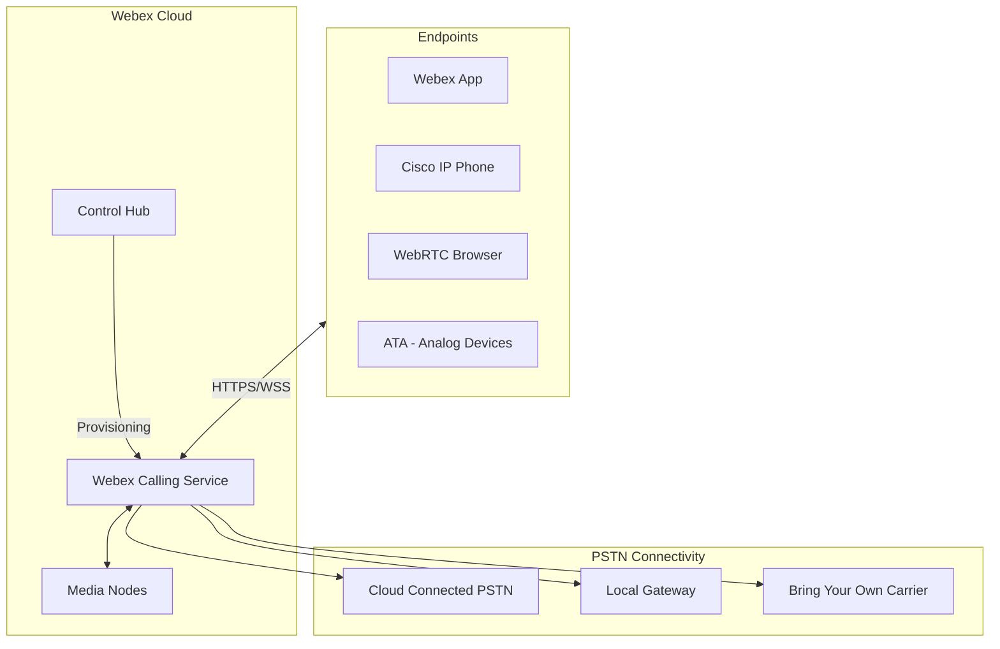
```mermaid
flowchart TB
    subgraph Endpoints["Endpoints"]
        WApp[Webex App]
        Cisco_Phone[Cisco IP Phone]
        WebRTC[WebRTC Browser]
        Analog[ATA - Analog Devices]
    end
    
    subgraph Webex["Webex Cloud"]
        WC[Webex Calling Service]
        Control[Control Hub]
        Media_Node[Media Nodes]
    end
    
    subgraph PSTN_Options["PSTN Connectivity"]
        CCP[Cloud Connected PSTN]
        LGW[Local Gateway]
        BYOC[Bring Your Own Carrier]
    end
    
    Endpoints <-->|HTTPS/WSS| WC
    WC <--> Media_Node
    Control -->|Provisioning| WC
    
    WC --> CCP
    WC --> LGW
    WC --> BYOC
```

### Option 1: Cloud Connected PSTN (CCP)

Cisco-partnered carriers provide PSTN connectivity directly to Webex cloud.

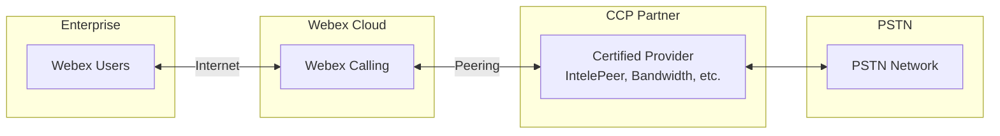
```mermaid
flowchart LR
    subgraph Enterprise["Enterprise"]
        Users[Webex Users]
    end
    
    subgraph Cisco["Webex Cloud"]
        WC[Webex Calling]
    end
    
    subgraph CCP_Provider["CCP Partner"]
        Partner[Certified Provider<br/>IntelePeer, Bandwidth, etc.]
    end
    
    subgraph PSTN["PSTN"]
        Network[PSTN Network]
    end
    
    Users <-->|Internet| WC
    WC <-->|Peering| Partner
    Partner <--> Network
```

**Pros:**
- No on-premises equipment
- Quick deployment
- Numbers managed in Control Hub

**Cons:**
- Limited carrier options
- Less routing control
- Availability varies by region

### Option 2: Local Gateway (On-Premises)

Enterprise-managed CUBE (Cisco Unified Border Element) or certified third-party SBC.

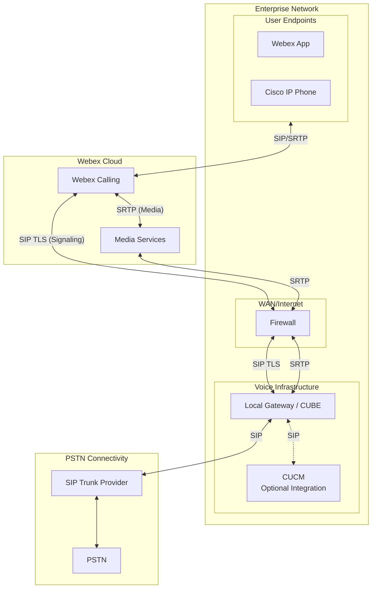
```mermaid
flowchart TB
    subgraph Enterprise["Enterprise Network"]
        subgraph Users_EP["User Endpoints"]
            WApp[Webex App]
            IP_Phone[Cisco IP Phone]
        end
        
        subgraph Voice_Infra["Voice Infrastructure"]
            LGW[Local Gateway / CUBE]
            CUCM[CUCM<br/>Optional Integration]
        end
        
        subgraph WAN["WAN/Internet"]
            FW[Firewall]
        end
    end
    
    subgraph Webex["Webex Cloud"]
        WC[Webex Calling]
        Media[Media Services]
    end
    
    subgraph PSTN_Conn["PSTN Connectivity"]
        Trunk[SIP Trunk Provider]
        PSTN[PSTN]
    end
    
    Users_EP <-->|SIP/SRTP| WC
    WC <-->|"SIP TLS (Signaling)"| FW
    FW <-->|SIP TLS| LGW
    WC <-->|"SRTP (Media)"| Media
    Media <-->|SRTP| FW
    FW <-->|SRTP| LGW
    
    LGW <-->|SIP| Trunk
    LGW <-.->|SIP| CUCM
    Trunk <--> PSTN
```

### Local Gateway Registration Flow

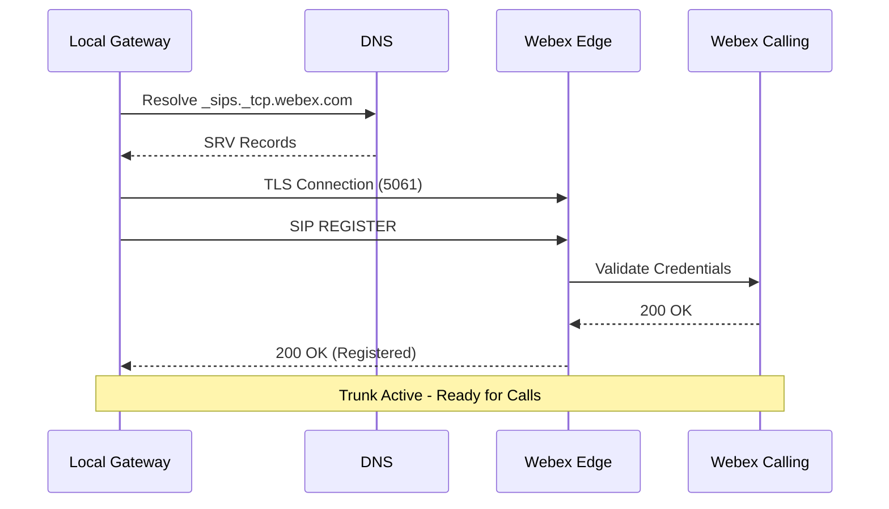
```mermaid
sequenceDiagram
    participant LGW as Local Gateway
    participant DNS as DNS
    participant Edge as Webex Edge
    participant WC as Webex Calling
    
    LGW->>DNS: Resolve _sips._tcp.webex.com
    DNS-->>LGW: SRV Records
    LGW->>Edge: TLS Connection (5061)
    LGW->>Edge: SIP REGISTER
    Edge->>WC: Validate Credentials
    WC-->>Edge: 200 OK
    Edge-->>LGW: 200 OK (Registered)
    Note over LGW,WC: Trunk Active - Ready for Calls
```

### Local Gateway Survivability

When Webex cloud is unreachable, calls can failover to local PSTN.

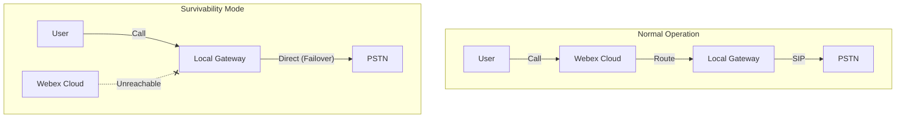
```mermaid
flowchart TB
    subgraph Normal["Normal Operation"]
        direction LR
        U1[User] -->|Call| WC1[Webex Cloud]
        WC1 -->|Route| LGW1[Local Gateway]
        LGW1 -->|SIP| PSTN1[PSTN]
    end
    
    subgraph Survivability["Survivability Mode"]
        direction LR
        U2[User] -->|Call| LGW2[Local Gateway]
        LGW2 -->|"Direct (Failover)"| PSTN2[PSTN]
        WC2[Webex Cloud]
        WC2 -.-x|"Unreachable"| LGW2
    end
```

### Option 3: Webex Calling Dedicated Instance

A dedicated, customer-specific instance of Webex Calling infrastructure for large enterprises.

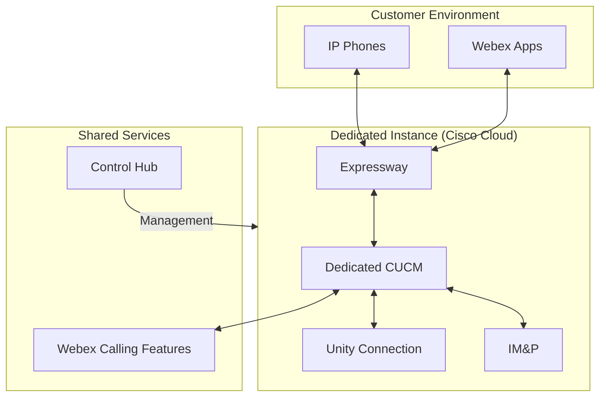
```mermaid
flowchart TB
    subgraph Customer["Customer Environment"]
        Phones[IP Phones]
        Apps[Webex Apps]
    end
    
    subgraph Dedicated["Dedicated Instance (Cisco Cloud)"]
        DI_CUCM[Dedicated CUCM]
        DI_CUC[Unity Connection]
        DI_IM[IM&P]
        Expressway[Expressway]
    end
    
    subgraph Shared["Shared Services"]
        WC[Webex Calling Features]
        Control[Control Hub]
    end
    
    Phones & Apps <--> Expressway
    Expressway <--> DI_CUCM
    DI_CUCM <--> DI_CUC
    DI_CUCM <--> DI_IM
    DI_CUCM <--> WC
    Control -->|Management| Dedicated
```

### Webex Calling CUBE Configuration Highlights

Key configuration elements for a Cisco CUBE as Local Gateway:

```
! Webex Calling Trunk Configuration Example (Simplified)

! Certificate Configuration
crypto pki trustpoint webex-cert
 enrollment terminal
 revocation-check none
 
! SIP Profile for Webex
voice class sip-profiles 100
 rule 10 request INVITE sip-header SIP-Req-URI modify "sips:" "sip:"
 
! Tenant for Webex Calling
voice class tenant 100
 registrar dns:webex.com scheme sips expires 240 refresh-ratio 50
 credentials number <DID> username <username> password <password>
 authentication username <username> password <password>
 sip-server dns:webex.com
 
! Dial-peer for Webex Calling
dial-peer voice 100 voip
 destination-pattern .T
 session protocol sipv2
 session transport tcp tls
 voice-class sip tenant 100
 codec g711ulaw
```

---

## Enterprise Network Integration

### Network Architecture Considerations

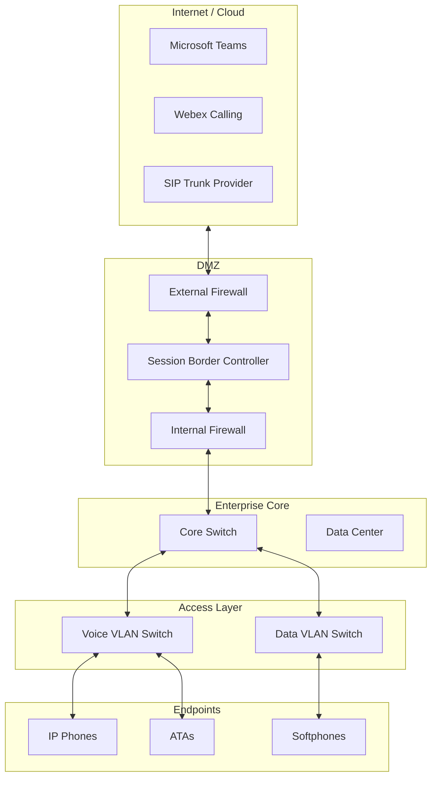
```mermaid
flowchart TB
    subgraph Internet["Internet / Cloud"]
        Teams[Microsoft Teams]
        Webex[Webex Calling]
        SIP_Provider[SIP Trunk Provider]
    end
    
    subgraph DMZ["DMZ"]
        FW_Ext[External Firewall]
        SBC[Session Border Controller]
        FW_Int[Internal Firewall]
    end
    
    subgraph Core["Enterprise Core"]
        CoreSW[Core Switch]
        DC[Data Center]
    end
    
    subgraph Access["Access Layer"]
        VoiceSW[Voice VLAN Switch]
        DataSW[Data VLAN Switch]
    end
    
    subgraph Endpoints["Endpoints"]
        IP_Phone[IP Phones]
        Softphone[Softphones]
        ATA[ATAs]
    end
    
    Internet <--> FW_Ext
    FW_Ext <--> SBC
    SBC <--> FW_Int
    FW_Int <--> CoreSW
    CoreSW <--> VoiceSW & DataSW
    VoiceSW <--> IP_Phone & ATA
    DataSW <--> Softphone
```

### VLAN Design for Voice

Best practice is to separate voice and data traffic:

| VLAN | Purpose | Typical Range | QoS Marking |
|------|---------|---------------|-------------|
| Voice VLAN | IP Phones | 10.10.x.0/24 | DSCP EF (46) |
| Data VLAN | PCs/Workstations | 10.20.x.0/24 | DSCP 0 |
| Management VLAN | Network Devices | 10.30.x.0/24 | DSCP CS6 |
| Guest VLAN | Guest Access | 10.40.x.0/24 | DSCP 0 |

### Firewall Rules for Cloud Calling

**Microsoft Teams:**

| Direction | Source | Destination | Ports | Protocol |
|-----------|--------|-------------|-------|----------|
| Outbound | Internal | *.teams.microsoft.com | 443 | TCP |
| Outbound | Internal | 52.112.0.0/14 | 3478-3481 | UDP |
| Outbound | Internal | 52.112.0.0/14 | 49152-53247 | UDP |
| Outbound | SBC | sip.pstnhub.microsoft.com | 5061 | TCP/TLS |

**Webex Calling:**

| Direction | Source | Destination | Ports | Protocol |
|-----------|--------|-------------|-------|----------|
| Outbound | Internal | *.webex.com | 443 | TCP |
| Outbound | Internal | *.wbx2.com | 443 | TCP |
| Outbound | Endpoints | Webex Media | 8500-8700, 19560-65535 | UDP |
| Outbound | LGW | Webex Edge | 5061 | TCP/TLS |

### Branch Office Design

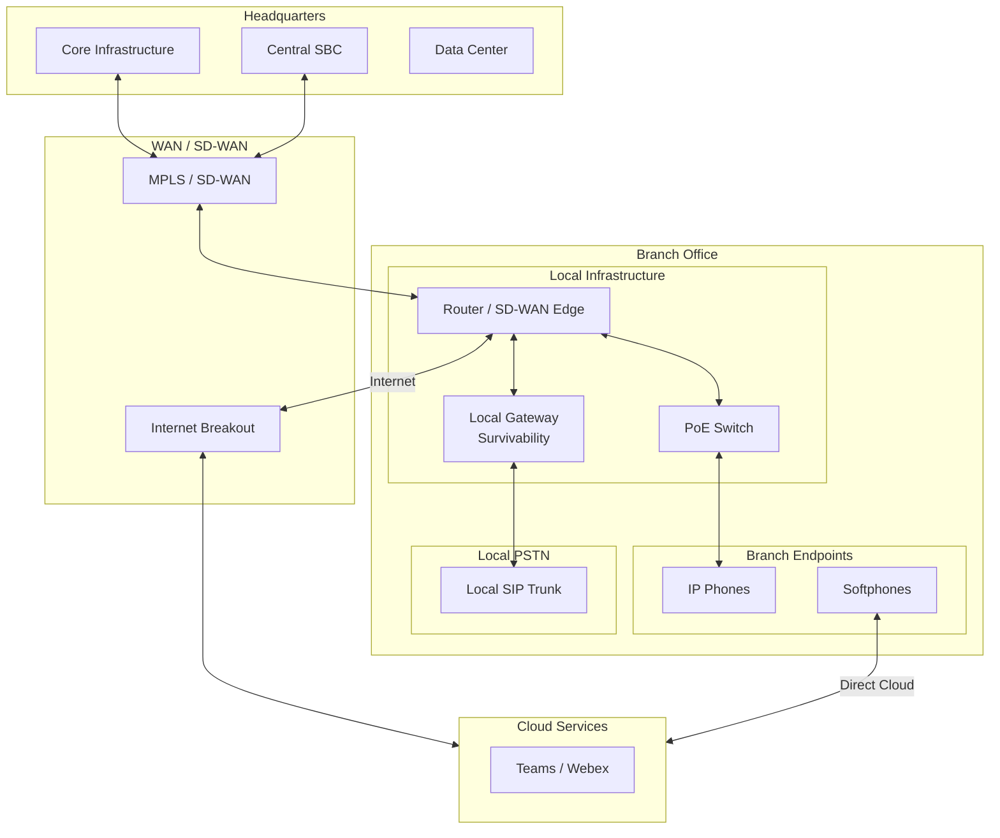
```mermaid
flowchart TB
    subgraph HQ["Headquarters"]
        HQ_Core[Core Infrastructure]
        HQ_SBC[Central SBC]
        DC[Data Center]
    end
    
    subgraph WAN_Cloud["WAN / SD-WAN"]
        MPLS[MPLS / SD-WAN]
        Internet_B[Internet Breakout]
    end
    
    subgraph Branch["Branch Office"]
        subgraph Local_Infra["Local Infrastructure"]
            Router[Router / SD-WAN Edge]
            Switch[PoE Switch]
            LGW_B[Local Gateway<br/>Survivability]
        end
        
        subgraph Branch_EP["Branch Endpoints"]
            B_Phone[IP Phones]
            B_Soft[Softphones]
        end
        
        subgraph Local_PSTN["Local PSTN"]
            Local_Trunk[Local SIP Trunk]
        end
    end
    
    subgraph Cloud["Cloud Services"]
        Teams[Teams / Webex]
    end
    
    HQ_Core <--> MPLS
    HQ_SBC <--> MPLS
    MPLS <--> Router
    Router <--> Switch
    Switch <--> B_Phone
    Router <--> LGW_B
    LGW_B <--> Local_Trunk
    
    Router <-->|Internet| Internet_B
    Internet_B <--> Cloud
    B_Soft <-->|Direct Cloud| Cloud
```

---

## Quality of Service (QoS)

### Why QoS Matters for Voice

Voice traffic has specific requirements:
- **Latency:** < 150ms one-way (ideally < 100ms)
- **Jitter:** < 30ms
- **Packet Loss:** < 1%

### DSCP Markings for UC Traffic

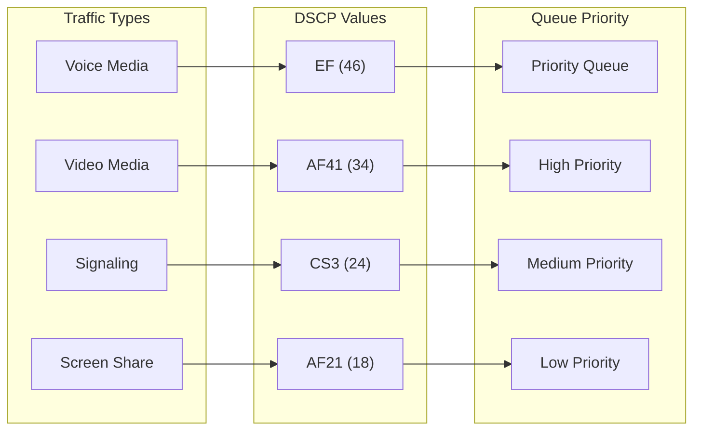
```mermaid
flowchart LR
    subgraph Traffic["Traffic Types"]
        Voice[Voice Media]
        Video[Video Media]
        Signal[Signaling]
        Screen[Screen Share]
    end
    
    subgraph DSCP["DSCP Values"]
        EF["EF (46)"]
        AF41["AF41 (34)"]
        CS3["CS3 (24)"]
        AF21["AF21 (18)"]
    end
    
    subgraph Queue["Queue Priority"]
        PQ["Priority Queue"]
        High["High Priority"]
        Med["Medium Priority"]
        Low["Low Priority"]
    end
    
    Voice --> EF --> PQ
    Video --> AF41 --> High
    Signal --> CS3 --> Med
    Screen --> AF21 --> Low
```

### QoS Policy Configuration (Cisco Example)

```
! Class Maps
class-map match-any VOICE
 match dscp ef
class-map match-any VIDEO
 match dscp af41
class-map match-any SIGNALING
 match dscp cs3 af31

! Policy Map
policy-map QOS-POLICY
 class VOICE
  priority percent 30
 class VIDEO
  bandwidth percent 30
 class SIGNALING
  bandwidth percent 10
 class class-default
  bandwidth percent 30
  fair-queue

! Apply to Interface
interface GigabitEthernet0/1
 service-policy output QOS-POLICY
```

### End-to-End QoS Path

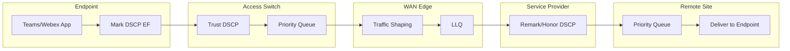
```mermaid
flowchart LR
    subgraph Endpoint["Endpoint"]
        App[Teams/Webex App]
        Mark1[Mark DSCP EF]
    end
    
    subgraph Access["Access Switch"]
        Trust[Trust DSCP]
        Queue1[Priority Queue]
    end
    
    subgraph WAN["WAN Edge"]
        Shape[Traffic Shaping]
        Queue2[LLQ]
    end
    
    subgraph Provider["Service Provider"]
        Remark[Remark/Honor DSCP]
    end
    
    subgraph Remote["Remote Site"]
        Queue3[Priority Queue]
        Deliver[Deliver to Endpoint]
    end
    
    App --> Mark1 --> Trust --> Queue1 --> Shape --> Queue2 --> Remark --> Queue3 --> Deliver
```

---

## Security Considerations

### VoIP Threat Landscape

| Threat | Description | Mitigation |
|--------|-------------|------------|
| **Toll Fraud** | Unauthorized use of trunks | Strong authentication, call limits |
| **Eavesdropping** | Intercepting RTP streams | SRTP encryption |
| **DoS/DDoS** | Overwhelming voice systems | SBC rate limiting, geo-blocking |
| **SRTP Downgrade** | Forcing unencrypted media | Enforce SRTP, reject RTP |
| **Operturn Fraud** | PBX hijacking | Regular audits, monitoring |
| **Vishing** | Voice phishing | User education |

### Security Architecture

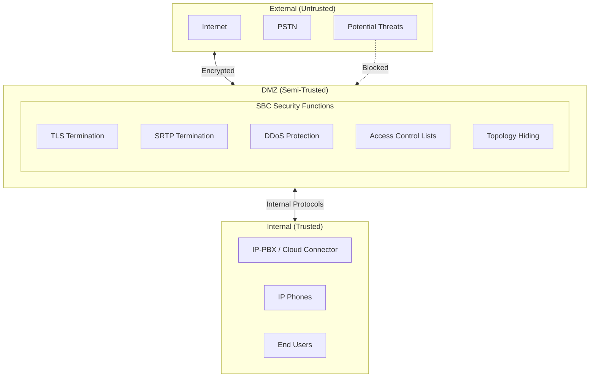
```mermaid
flowchart TB
    subgraph External["External (Untrusted)"]
        Internet[Internet]
        PSTN[PSTN]
        Attackers[Potential Threats]
    end
    
    subgraph DMZ["DMZ (Semi-Trusted)"]
        subgraph SBC_Security["SBC Security Functions"]
            TLS[TLS Termination]
            SRTP_Term[SRTP Termination]
            DDoS[DDoS Protection]
            ACL[Access Control Lists]
            Topo[Topology Hiding]
        end
    end
    
    subgraph Internal["Internal (Trusted)"]
        PBX[IP-PBX / Cloud Connector]
        Phones[IP Phones]
        Users[End Users]
    end
    
    External <-->|Encrypted| DMZ
    DMZ <-->|Internal Protocols| Internal
    
    Attackers -.->|Blocked| DMZ
```

### Encryption Requirements

**Signaling Encryption:**
- SIP over TLS (SIPS) on port 5061
- Minimum TLS 1.2
- Strong cipher suites (AES-256-GCM preferred)
- Certificate validation

**Media Encryption:**
- SRTP with AES-128 or AES-256
- Key exchange via SDES or DTLS-SRTP
- No fallback to RTP

### Certificate Management

```mermaid
flowchart TB
    subgraph CA["Certificate Authority"]
        Root[Root CA]
        Intermediate[Intermediate CA]
    end
    
    subgraph Devices["Voice Devices"]
        SBC[SBC Certificate]
        LGW[Local Gateway Cert]
        Phones[Phone Certificates]
    end
    
    subgraph Validation["Certificate Validation"]
        Chain[Chain Validation]
        CRL[CRL/OCSP Check]
        SAN[SAN Verification]
    end
    
    Root --> Intermediate
    Intermediate --> SBC & LGW & Phones
    SBC & LGW --> Chain --> CRL --> SAN
```

---

## Comparison Matrix

### Teams vs Webex Calling Comparison

| Feature | Microsoft Teams | Webex Calling |
|---------|-----------------|---------------|
| **Cloud PBX** | Phone System | Webex Calling |
| **Direct PSTN** | Calling Plans | Cloud Connected PSTN |
| **Carrier Connect** | Operator Connect | CCP Partners |
| **BYOC** | Direct Routing | Local Gateway |
| **SBC Required** | Yes (Direct Routing) | Yes (Local Gateway) |
| **Survivability** | SBA (Survivable Branch Appliance) | Local Gateway Mode |
| **Certified SBCs** | AudioCodes, Ribbon, Oracle, Cisco | CUBE, AudioCodes, Ribbon |
| **Media Bypass** | Yes | Yes |
| **E911** | Native + Partners | RedSky, Intrado, etc. |
| **Analog Support** | Via ATA | Native ATAs |
| **Max Locations** | Unlimited | Varies by license |

---

## Summary

### Decision Framework

```mermaid
flowchart TB
    Start[PSTN Connectivity Decision] --> Q1{Existing<br/>Infrastructure?}
    
    Q1 -->|No Legacy PBX| Cloud[Cloud-Native]
    Q1 -->|Legacy PBX| Hybrid[Hybrid Approach]
    
    Cloud --> Q2{Carrier<br/>Flexibility?}
    Q2 -->|Use Platform Carrier| Native[Calling Plans / CCP]
    Q2 -->|Own Carrier| BYOC_C[Direct Routing / Local GW<br/>Cloud SBC]
    
    Hybrid --> Q3{Keep PBX?}
    Q3 -->|Yes| Integration[PBX Integration<br/>+ SIP Trunk]
    Q3 -->|Phase Out| Migration[Gradual Migration<br/>Direct Routing / Local GW]
    
    Native --> Deploy1[Deploy]
    BYOC_C --> Deploy2[Deploy SBC + Trunks]
    Integration --> Deploy3[Deploy SBC + Configure]
    Migration --> Deploy4[Parallel Operation]
```

### Key Takeaways

1. **SIP Trunking** replaces legacy PRI/T1 connections with IP-based PSTN connectivity
2. **Session Border Controllers (SBCs)** are critical for security, interoperability, and media handling
3. **Microsoft Teams Direct Routing** offers maximum flexibility but requires SBC expertise
4. **Webex Calling Local Gateway** provides similar flexibility with Cisco CUBE
5. **QoS** is essential—prioritize voice traffic end-to-end
6. **Encryption** (TLS + SRTP) is mandatory in modern deployments
7. **Survivability** planning ensures calls continue during cloud outages

---

## Additional Resources

- [Microsoft Teams Direct Routing Documentation](https://docs.microsoft.com/en-us/microsoftteams/direct-routing-landing-page)
- [Cisco Webex Calling Administration Guide](https://help.webex.com/en-us/landing/ld-n1uv3hs-WebexCalling/)
- [SIP RFC 3261](https://tools.ietf.org/html/rfc3261)
- [SRTP RFC 3711](https://tools.ietf.org/html/rfc3711)
